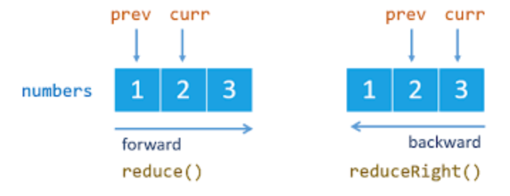

# Arrays

Complexe types

Link a reference insted of storing a value.

```javascript
let array1 = [1, 2, 3];
let array2 = array1; // array2 is an alias of array1

array1.push(5); // [1,2,3,5]
console.log(array2); // [1,2,3,5]
```

[Spread operator](https://developer.mozilla.org/en-US/docs/Web/JavaScript/Reference/Operators/Spread_syntax)

```javascript
let array1 = [1, 2];
let array2 = [array1, 3, 4]; // [ [1,2], 3,4]
let array3 = [...array1, 3, 4]; // [1,2,3,4]
```

## Methods

### Remove stuff

**[`array.shift()`](https://developer.mozilla.org/en-US/docs/Web/JavaScript/Reference/Global_Objects/Array/shift)** /
**[`array.pop()`](https://developer.mozilla.org/en-US/docs/Web/JavaScript/Reference/Global_Objects/Array/shift)**

Remove first / last element of an array and store it

```javascript
let array = [1, 2, 3, 4];
let firstElement = array.shift(); // 1
let lastElement = array.pop(); // 4
console.log(array); // [2,3]
```

**[`array.slice()`](https://developer.mozilla.org/en-US/docs/Web/JavaScript/Reference/Global_Objects/Array/slice)**

Return new array with portion of initial array

```javascript
let array = [1, 2, 3, 4];
let arraySliced_1 = array.slice(1, 3); // [2,3]
let arraySliced_2 = array.slice(1, -1); // [2,3]
```

### [`array.filter()`](https://developer.mozilla.org/en-US/docs/Web/JavaScript/Reference/Global_Objects/Array/filter)

_Create new array with all elements that pass the test (the function in argument)_

```javascript
let array1 = [1, 2, 3];
let array2 = array1.filter((element) => element < 3); // [1, 2]
```

### [`array.map()`](https://developer.mozilla.org/en-US/docs/Web/JavaScript/Reference/Global_Objects/Array/map)

_Run a given function on each item of an array_

```javascript
let array1 = [1, 2, 3];
let array2 = array1.map((element) => element * 2); // [2, 4, 6]
```

_Define object_

```javascript
let array1 = ["a", "b", "c"];
let array2 = array.map((element, index) => ({ [index]: element })); // [{0:a} {1:b} {2:c}]
```

### [`array.reduce()`](https://developer.mozilla.org/en-US/docs/Web/JavaScript/Reference/Global_Objects/Array/Reduce) / [`array.reduceRight()`](https://developer.mozilla.org/fr/docs/Web/JavaScript/Reference/Global_Objects/Array/ReduceRight)

_Run a given function on each element and keep it through an accumulator, resulting in a single output value. Can optionaly define the initial value to start with_

```javascript
let array1 = [1, 2, 3];
const sum = array1.reduce((acc, curr) => acc + curr); // 6
const sum2 = array1.reduce((acc, curr) => acc + curr, 4); // 10
```



### [`array.sort()`](https://developer.mozilla.org/en-US/docs/Web/JavaScript/Reference/Global_Objects/Array/sort)

_Sort elements of an array and return the sorted array. Take a facultative comparaison function, which handle two arguments: the first element of the array compared with the second one_

```javascript
let array1 = [3, 2, 1];
array1.sort(); // [1,2,3]
array1.sort((firstEl, secondEl) => secondEl - firstEl); // [3,2,1]
```
